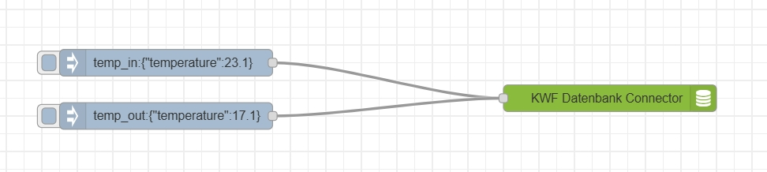

# NodeRED Connector für KWF Energiemonitor (beta)
Dieser Node ist der Kernbaustein des KWF Energiemonitors. Du musst dich nur noch darum kümmern, die gewünschten Datenkanäle einzulesen, und sie in einem passenden Intervall mit dem richtigen Topic an diesen Baustein (KWF Datenbank-Connector) zu schicken, und dieser Block übernimmt den Rest, nämlich:
- Daten in einer lokalen Datenbank zwischenspeichern
- Daten regelmässig (1 mal pro Stunde) oder wenn wieder eine Internetverbindung vorhanden ist, an die Datenbank zu schicken.

So sieht eine Beispiel-Konfiguration aus. Deine NodeRED-Bausteine sollten noch folgende Aufgaben übernehmen:
- Daten ggf. aggregieren und in der empfohlenen Frequenz an diesen Connector schicken
- Das richtige Topic anfügen (siehe unten bei Topics)
- Sicherstellen, dass der Wert richtig benannt ist (siehe unten bei Topics)



### Installation
Im Moment kann dieser Node nur über Github installiert werden. Direkt in Balena (node-red Terminal) in den folgenden Ordner gehen und von Git installieren: 
```
cd ../../../data/node-red/user/node_modules/
npm install https://github.com/Verein-Kleinwohnformen/kwf-energiemonitor-db.git
```

### Konfiguration
Es werden zwei Parameter verwendet:
- Einen Pfad, auf dem Daten persistent gespeichert werden können (für die Datenbank zur Zwischenspeicherung). Für eine Einrichtung auf Balena den Default-Wert beibehalten
- Deinen Device API-Key, am besten aus den Balena Device-Variablen übernehmen

### Topics
Damit dieser Node verschiedene Input-Daten unterscheiden kann, müssen die Topics von NodeRED verwendet werden. Momentan werden folgende Topics unterstützt:

| Topic | Key | Empfohlenes Intervall | Beschreibung |
|----------|----------|----------|-----------|
| temp_in   | temperature  | 1-10 Minuten   | Innentemperatur. Wenn mehrere Werte gemessen werden, bitte vorher einen Durchschnitt bilden. |
| temp_out   | temperature   | 1-10 Minuten  | Aussentemperatur
