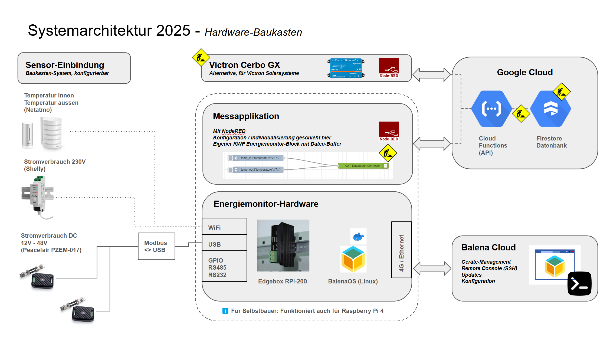
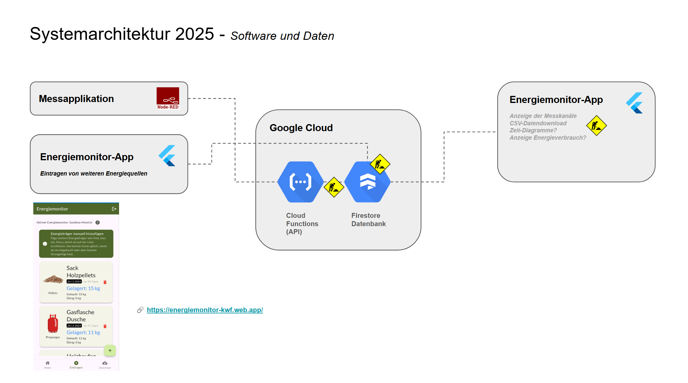
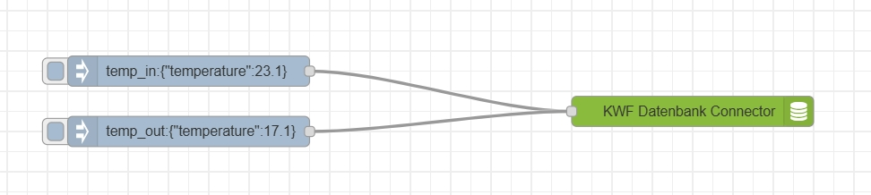

# Das Projekt Energiemonitor
Dieses Projekt soll es dir ermöglichen, deinen Energieverbrauch zu messen, in Echtzeit zu analysieren, zu verstehen und zu optimieren - mit dem Ziel dass du mit den einfachen aber richtigen Aktionen im Alltag 20% deines Energieverbrauchs einsparen kannst. Dieses Projekt wird vom [Verein Kleinwohnformen](https://kleinwohnformen.ch) getragen und ist in erster Linie auf kleine, unabhängige Wohnformen zugeschnitten. Es ist aber nicht ausgeschlossen, dass du unseren Monitor auch für deine Wohnung bauen und nutzen kannst - wir sind Open Source und Mitmachen im Projekt ist erwünscht! Einfach melden beim [Energiemonitor-Team](mailto:energiemonitor@kleinwohnformen.ch).

## Projekt-Repos
- [Referenz-HW und Provisionierung mit BalenaOS](https://github.com/Verein-Kleinwohnformen/energiemonitor-balena-nodered)
- [NodeRED-Connector neu](https://github.com/Verein-Kleinwohnformen/kwf-energiemonitor-db)
- [NodeRED Beispiel-Flows (depr.)](https://github.com/Verein-Kleinwohnformen/energiemonitor-nodered-flows)
- [Energiemonitor-App (Repo)](https://github.com/Verein-Kleinwohnformen/energiemonitor-app)
- [Energiemonitor-App (Demo)](https://energiemonitor-kwf.web.app/)

## Angestrebte Architektur
Wir befinden uns noch in der Designphase, viele der eingezeichneten Komponenten existieren noch nicht. Wir streben aber das folgende System an:

# NodeRED Connector für KWF Energiemonitor (beta)
Dieser Node ist der Kernbaustein des KWF Energiemonitors. Du musst dich nur noch darum kümmern, die gewünschten Datenkanäle einzulesen, und sie in einem passenden Intervall mit dem richtigen Topic an diesen Baustein (KWF Datenbank-Connector) zu schicken, und dieser Block übernimmt den Rest, nämlich:
- Daten in einer lokalen Datenbank zwischenspeichern
- Daten regelmässig (1 mal pro Stunde) oder wenn wieder eine Internetverbindung vorhanden ist, an die Datenbank zu schicken.

So sieht eine Beispiel-Konfiguration aus. Deine NodeRED-Bausteine sollten noch folgende Aufgaben übernehmen:
- Daten ggf. aggregieren und in der empfohlenen Frequenz an diesen Connector schicken (Idee: Zukünftig könnte auch dieser Konnektor Daten aggregieren, um Fehler und falsche Inputs in der Datenbank zu vermeiden)
- Das richtige Format sicherstellen
- Das richtige Topic anfügen

Das sieht dann so aus. Auf der linken Seite hast du deine Mess-Blocks, die alle mit unserem Connector verbunden sind.

### Installation
Dieser Node ist bereits in der [NodeRED-Library](https://flows.nodered.org/node/@vereinkleinwohnformen/node-red-energiemonitor) verfügbar.

### Konfiguration
Diese Parameter müssen konfiguriert werden:
- Einen Pfad, auf dem Daten persistent gespeichert werden können (für die Datenbank zur Zwischenspeicherung). Für eine Einrichtung auf Balena den Default-Wert beibehalten. Im Fall von Datenbank-Fehlern (z.B. alte Version des Blocks hat bereits ein anderes Datenbank-Format) kann es helfen, den Namen des Datenbank-Files auszutauschen.
- Sende-Intervall (ms), in dem die Daten an die Datenbank gesendet werden. Zum Testen ca. 1 Minute nehmen und im Betrieb 1 Stunde (Default).
- Die URL der API, am besten aus den Balena Flotten-Variablen übernehmen
- Deinen Device API-Key, am besten aus den Balena Device-Variablen übernehmen

### Topics
Damit dieser Node verschiedene Input-Daten unterscheiden kann, müssen die Topics von NodeRED verwendet werden. Momentan werden folgende Topics unterstützt:

| Sensorbeschreibung                                                                                 | Topic              | Format | Beispiel |
|--------------------------------------------------------------------------------------------------|-----------------|---------|-----------|
| Netatmo Wetterstation mit Temperatur, Luftfeuchtigkeit, CO2, Luftdruck innen sowie Temperatur und Luftfeuchtigkeit aussen. | netatmo           | json    | <pre>{   "netatmo_indoor_id": "xx-xx-xx",   "indoor_reachable": true,   "indoor_signal": -76,   "indoor_temperature": 23.1,   "indoor_humidity": 61.3,   "indoor_co2": 1237,   "indoor_pressure": 986.3,   "outdoor_reachable": true,   "netatmo_outdoor_id": "xx-xx-xx",   "outdoor_temperature": 16.3,   "outdoor_humidity": 83,   "outdoor_battery": 26,   "outdoor_signal": -81,   "warning": null }</pre> |
| Indoor-Temperatur von einem anderen Sensor                                                     | temperature_indoor | number | 23.1      |
| Outdoor-Temperatur von einem anderen Sensor                                                    | temperature_outdoor | number | 16.7      |
| Indoor-Luftfeuchtigkeit von einem anderen Sensor                                               | humidity_indoor   | number | 56.3      |
| Outdoor-Luftfeuchtigkeit von einem anderen Sensor                                              | humidity_outdoor | number | 83         |
| AC Verbrauch (W) Phase 1, gemessen übers Victron System                                        | victron_ac_l1_p  | number | 800.3      |

## Todo
Weitere Aufgaben für dieses Projekt:
- Support für Victron Cerbo GX testen
- Basis-Sensoren des Energiemonitor-Kits einbinden
- Weitere Datenformate unterstützen: Alle Victron-Geräte, sowie weitere Input-Daten
- Aggregation der Messdaten übernehmen, damit nicht zuviele Daten in die Cloud geschickt werden können, sondern vorher ein Durchschnitt gebildet wird
